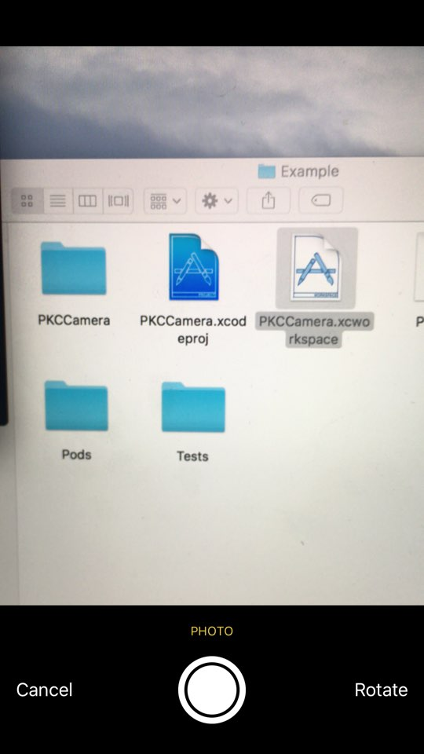
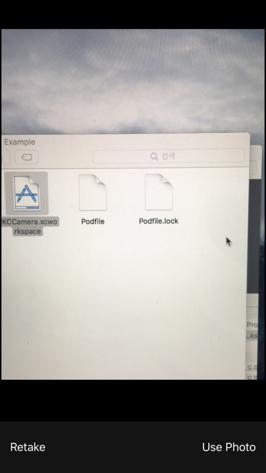

# PKCCamera

[](https://travis-ci.org/pikachu987/PKCCamera)
[](http://cocoapods.org/pods/PKCCamera)
[](http://cocoapods.org/pods/PKCCamera)
[](http://cocoapods.org/pods/PKCCamera)

## Example

To run the example project, clone the repo, and run `pod install` from the Example directory first.

## example Image




## Requirements

## Installation

PKCCamera is available through [CocoaPods](http://cocoapods.org). To install
it, simply add the following line to your Podfile:

```ruby
pod "PKCCamera"
```

## Author

pikachu987, pikachu77769@gmail.com

## License

PKCCamera is available under the MIT license. See the LICENSE file for more info.
